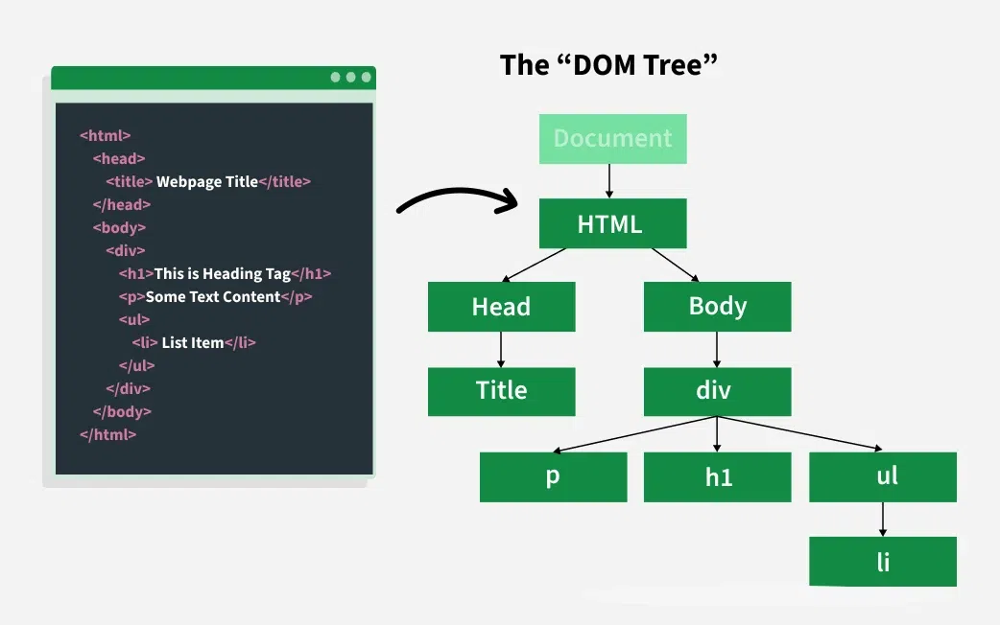

 # Intro al DOM
 	
¿Qué es el DOM?

DOM: Document Object Model

Estructura del DOM

Manipulación del DOM con JavaScript

Selección de elementos

Manipulación de elementos

Casos de uso comunes del DOM
Manejo de eventos con addEventListener
Sintaxis de addEventListener
Más ejemplos con addEventListener