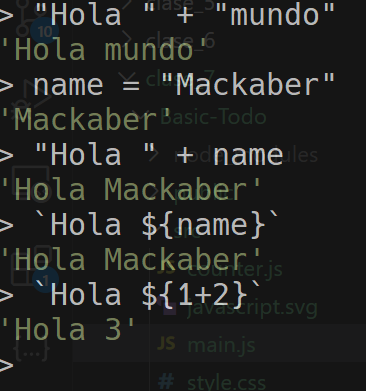

- Manejo de CSS clases con JavaScript
- Manejo de proyects con Vite:
    - Setup
    - Componentes

# Vite

## Setup
    
Comandos:

1. $ npm install vite -g

2. $ npx create-vite@latest
    - Seleccionar vanilla
    - Seleccionar javascript

3. $ cd my-project

4. $ npm install

5. $ npm run dev

### String templates

