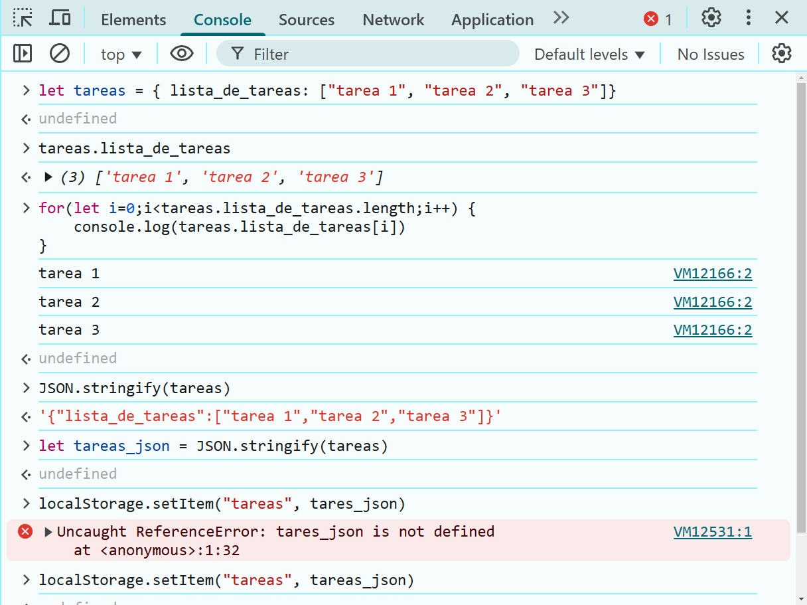
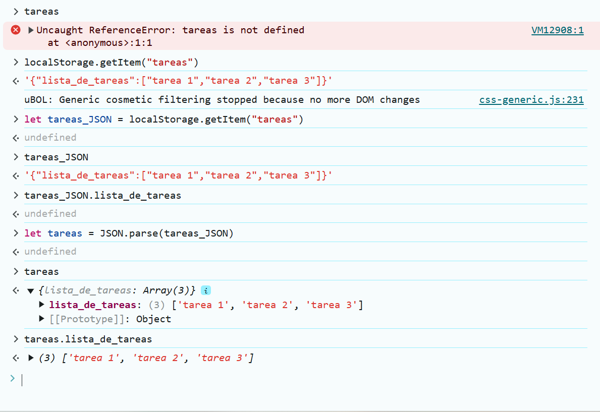

# Clase 8:

Opciones:
- Presentacion de avances
- Dejar tiempo para trabajar en el proyecto final
- Repasar temas del modulo:
    - Estructuras de control:
        - If, else
        - Ciclos:
            - For
            - While
    - Arreglos
    - Objetos Literales
    - (X) DOM:
        - getElement...
        - innerHTML, outerHTML, addNode, removeNode
- (X) LocalStorage

## LocalStorage

Base de datos que guarda pares de key y values para un dominio o página específicos

- localStorage.getItem
- localStorage.setItem

- Sintaxis:

    - guardar un valor
    localStorage.setItem("nombre_de_la_llave", "valor_de_la_llave")

    - obtener el valor
    localStorage.getItem("nombre_de_la_llave") 

## JSON

JSON: JavaScript Object Notation
Es un documento/string/texto que corresponde a un objeto literal de JavaScript

- JSON.parse (JSON (texto) -> Objeto literal)
- JSON.stringify (Objeto literal -> JSON (texto))

- Sintaxis:

    - Pasar de JSON a Objeto literal
    JSON.parse(json_existente)

    - Pasar de Objeto literal a JSON
    JSON.stringify(objeto_literal_existente)

## Usando JSON con LocalStorage
Antes de cargar la página:

Despues de cargar la página:
