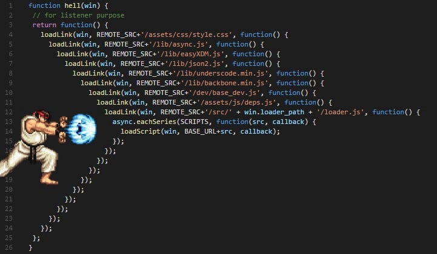

# Uso de Callback y JSON para manejo de datos asincronos

- Aprender qué son los callbacks y su estructura.
- Identificar y parsear datos en formato JSON.
- Relacionar JSON con la estructura de objetos en JS. 
- Reconocer el problema del 'callback hell'.

