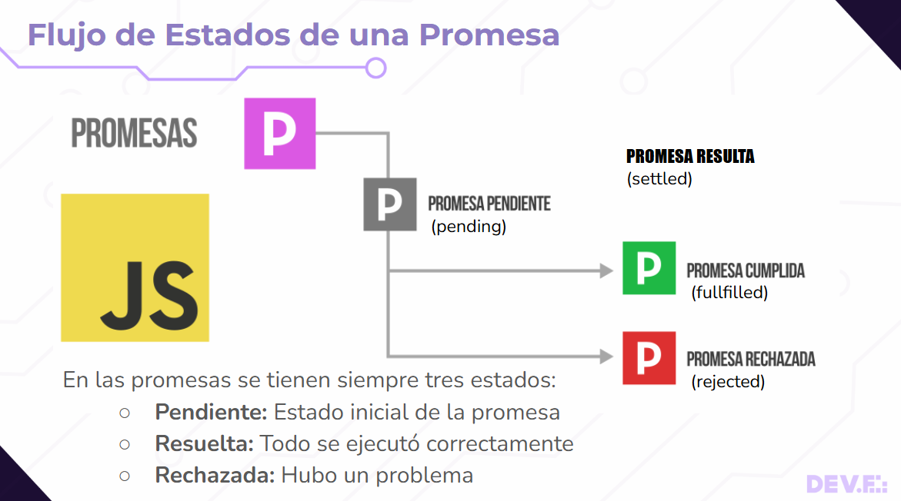

 
 	
🎯 Objetivos de la clase

- Comprender qué es una promesa y sus tres estados.

- Aplicar .then y .catch para manejar resultados.
- Convertir promesas a async/await.
- Manejar errores con try/catch.