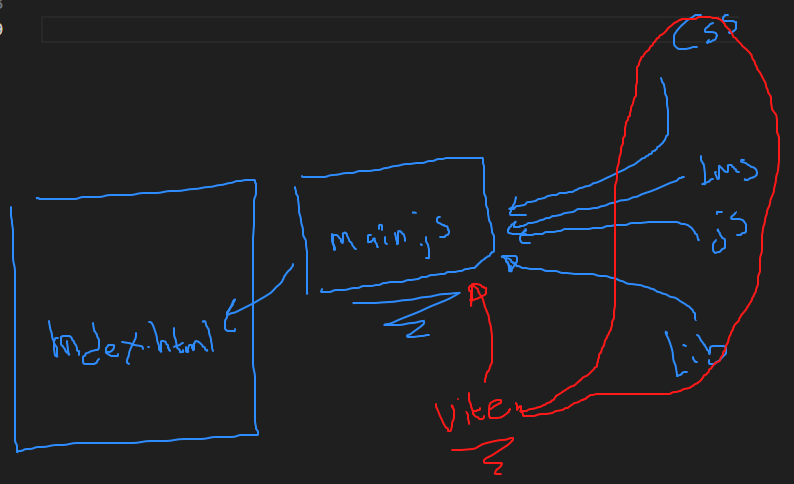

# Uso de Vite

- Comprender qué es Vite y por qué se usa.

    1. Genera los archivos básicos del proyecto
    2. Transpilar el código (juntar todos los archivos del proyecto en uno sólo) 
    3. Trae su propio servidor de desarrollo (Alternativa a LiveShare)

- Crear un nuevo proyecto con Vite.

```bash
    npm create vite@latest
```

- Correr y construir un proyecto con Vite.

```bash
    npm run dev
```


## Import/Export
```js
// main.js
import func from './function.js'

// function.js
export default const funct = () => {

}
```
O

```js

// app.js
import { funct1, funct2, funct3 } from './functions.js'

// functions.js
export const funct1 = () => {

}

export const funct2 = () => {
    
}

export const funct3 = () => {
    
}

export const funct4 = () => {
    
}
```


- Conocer diferencias clave frente a otras herramientas.


